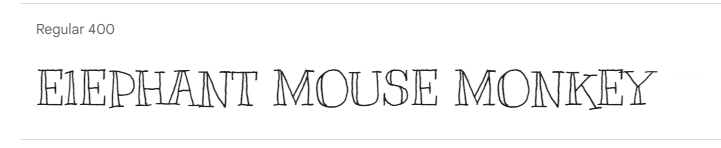
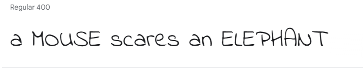
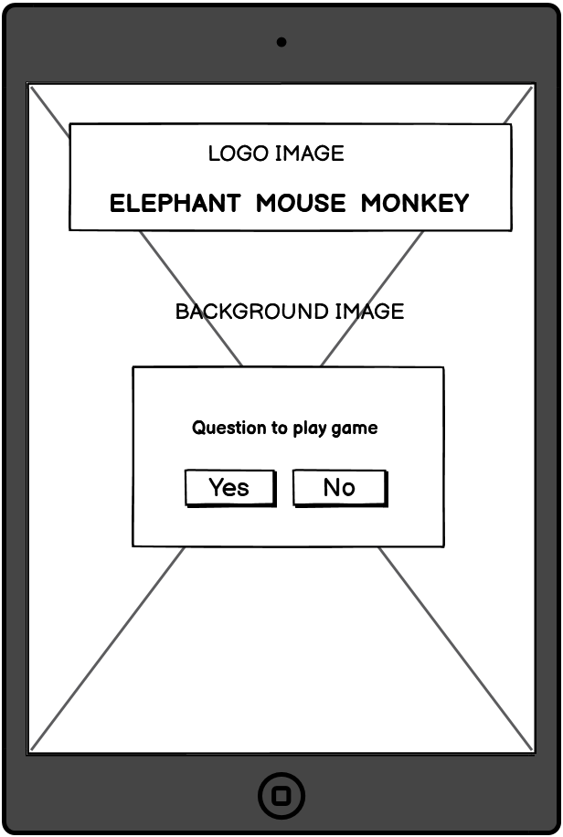
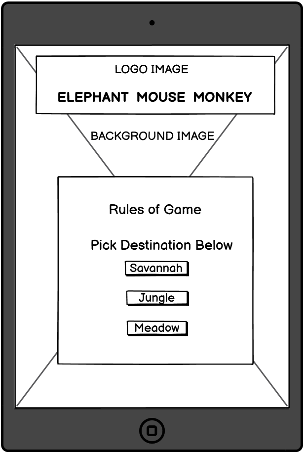
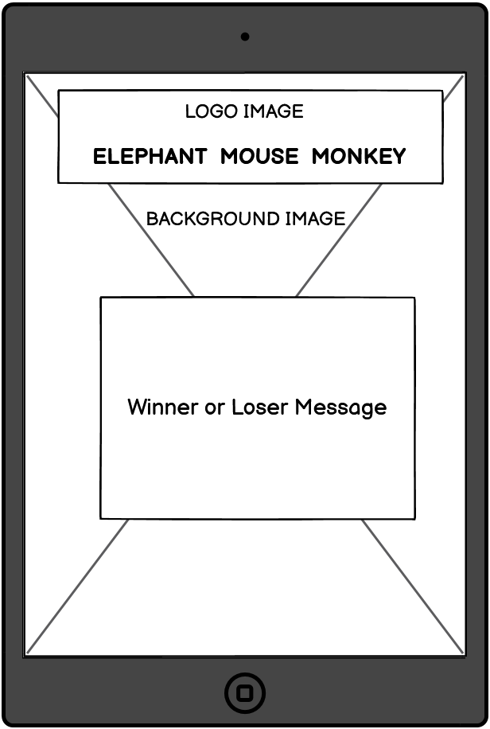

# Elephant Mouse Monkey

This is a variation of the game of chance 'Rock' 'Paper' 'Scissor' but with additional features designed to keep children entertained.

You can choose your own 'destination' of either the Forest, Savannah or Meadow to play, you then pick 'Elephant' 'Mouse' or 'Monkey' to battle the computer to see who comes out on top.

Everyone knows that 'Mice scare Elephants' 'Monkeys catch Mice' and 'Elephants squash Monkeys!!'

## CONTENTS

* [User Experience](#user-experience)
  * [Who is the game for](#who-is-the-game-for)
  * [User Stories](#user-stories)

* [Design](#design)
  * [Colour Scheme](#colour-scheme)
  * [Typography](#typography)
  * [Images](#images)
  * [Wireframes](#wireframes)

## User Experience

### Who is the game for

The game is for all ages but primarily designed for children.
This meant the game had to entertain and be eye catching to grab the users attention.
Because the game is to be used by children it was important to make the users journey clear and easy to follow.  

### User Stories  

#### User goals

* As a user I want to be entertained so I don't get bored.
* As a user I want to know what I am doing so I don't get confused.
* As a user I want to play a simple game against a computer to see if I come out on top. 
* As a returning user I would like to play again and show my friends.

#### The websites goals

* As the site owner I want to entertain the user.
* As the site owner I would like to provide a simple game that all can play on a multitude of device types.
* As the site owner I would like to encourage the user to play more than once and return to the site.

#### How will the goals be acheived

* Engaging UX that to grab childrens attention and be fun. Bright colors, fun typography and cartoon images all matching the animal theme of the game.
* A fun and informative question to start the game.
* Options to change the background image will keep the user entertained and encourage them to play again.
* Large, intuitive buttons so the navigation is straight forward.
* A set amount of rounds of the game to play so a winner is determained and informed by a results screen.
* A simple layout that is responsive on all device types.

## Design

### Colour Scheme

Because this game is designed to be enjoyable for children I opted to go for a really bright, colorful and cheerful color scheme. Some of the research I undertook on UX for children can be found on[Children-first-design](https://uxdesign.cc/ux-for-kids-responsible-matter-802bd12fe28c).

To meet WCAG 2.0 criteria, the color scheme was then passed to [eightshapes.com](https://contrast-grid.eightshapes.com/) to generate an accessibility table, I then only used accessible text colors to ensure easy reading.

### Typography

Google Fonts was used to import the chosen fonts for use in the site.

Again because this is a game with children in mind I used fun, kiddy fonts designed to entertain.

For The headings I used Kranky, its a fun-filled font with is very stylised ideal for headings:

For the more dense parts of text, like the initial question and rules I used Indie Flower, again designed to be fun:

### Images

All the images were taken from [www.vecteezy.com/](https://www.vecteezy.com/) with no attribution required.
The images chosen are to enhance the UX for the target audience. The images are bright and cartoonish matching the games animal theme and looking to entertain the user.

### Wireframes

Balsamiq was used to design my wireframes.

Because the game requires a specific layout the wireframes remain the same across all devices.
The site is responsive and does ajust image and font size depending on device size but the layout remains the same.

### Landing Page

### Rules and destination choice section

### Main game

### Results section

