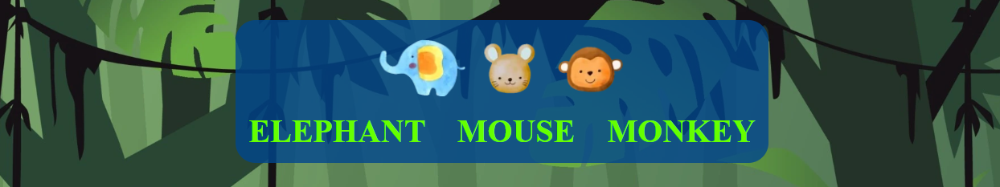

# Elephant Mouse Monkey  

  

Visit the deployed site: [Elephant Mouse Monkey](https://daviddock.github.io/ElephantMouseMonkey/)

This is a variation of 'Rock' 'Paper' 'Scissor' with additional features designed to keep children entertained.

There is a multiple choice question to start with and a choice of background for the game area.
 
You can choose an 'Elephant' 'Mouse' or 'Monkey' to battle the computer to see who comes out on top.  

Everyone knows that:  
'Mice scare Elephants'  
'Monkeys catch Mice' and  
'Elephants squash Monkeys!'

## CONTENTS

* [User Experience](#user-experience)
  * [Who is the game for](#who-is-the-game-for)
  * [User Stories](#user-stories)

* [Design](#design)
  * [Colour Scheme](#colour-scheme)
  * [Typography](#typography)
  * [Images](#images)
  * [Wireframes](#wireframes)

* [Features](#features)
  * [Languages Used](#languages-used)
  * [Favicon](#favicon)
  * [Logo and Title](#logo-and-title)
  * [Question Area](#question-area)
  * [Rules Area](#rules-area)
  * [Game Area](#game-area)
  * [Winner Area](#winner-area)
  * [Loser Area](#loser-area)
  * [404 Page](#404-page)
  * [Accessibility](#accessibility)
  * [Future Implementations](#future-implementations)

* [Deployment](#deployment)
* [Testing](#testing)
* [Credits](#credits)

## User Experience

### Who is the game for

The game is for all ages but primarily designed for children.
This means that the game has to entertain and be eye catching to grab the users attention.
Because the game is to be used by children it is important to ensure the user journey is clear and simple to follow.  

### User Stories  

#### User goals

* As a user I want to be entertained so I do not get bored.
* As a user I want to know what I am doing so I do not get confused.
* As a user I want to play a simple game against a computer to see if I come out on top. 
* As a returning user I would like to play again and show my friends.

#### The websites goals

* As the site owner I want to entertain the user.
* As the site owner I would like to provide a simple game can be played on all device types.
* As the site owner I would like to encourage the user to play more than once and return to the site.
* As a site owner I want to teach the user new facts whilst playing.

#### How will the goals be acheived

* Engaging designs to grab children's attention and be fun. Bright colors, fun typography and cartoon images all matching the animal theme of the game.
* A fun and informative question to start the game, teaching the user a fact about the subject matter. There will be a number of different questions to keep the returning player enertained.
* Options to change the background image will keep the user entertained and encourage them to play again.
* Large, self explanatory buttons so the navigation is straight forward.
* A set amount of rounds of the game to play so a winner is determained and informed by a results screen.
* A simple layout that is responsive on all device types.

## Design

### Colour Scheme

Because this game is designed to be enjoyable for children I opted to go for a really bright, colorful and cheerful color scheme. Some of the research I undertook on UX for children can be found on [Children-first-design](https://uxdesign.cc/ux-for-kids-responsible-matter-802bd12fe28c).

To meet WCAG 2.0 criteria, the color scheme was then passed to [eightshapes.com](https://contrast-grid.eightshapes.com/?version=1.1.0&background-colors=&foreground-colors=%23ffffff%0D%0A%23000000%0D%0A%2366ff00%0D%0A%2308e8de%0D%0A%23fc74fd%0D%0A%23803790%0D%0A%23fd0e35%0D%0A%2300468c%0D%0A%23013220%0D%0A%0D%0A&es-color-form__tile-size=compact&es-color-form__show-contrast=aaa&es-color-form__show-contrast=aa&es-color-form__show-contrast=aa18&es-color-form__show-contrast=dnp) to generate an accessibility table, I then only used accessible text colors to ensure easy reading.

### Typography  

Again because this is a game with children in mind I used fun, playful fonts designed to entertain.

For The headings I used Kranky, its a fun-filled font which is very stylised and ideal for headings:

For the more dense parts of text, like the initial question and rules I used Indie Flower, again designed to be fun:

### Images

The images chosen are to enhance the user experience for the target audience. The images are bright and 
 animated matching the games animal theme and looking to entertain the user. There are large background images covering each page and the user can choose a background image they woukd like for the game.

### Wireframes

The website's layout remains the same for mobile and tablet devices.  

The site is responsive and adjusts image and font size depending on device size.  

The website's layout changes for the rules page and games page when devices reach 1024 px and above.  

## Features  

### Languages Used  

HTML, CSS, JavaScript  

### Favicon

The favicon for this website was created at [https://favicon.io/](https://favicon.io/). It is an image taken from the websites logo.

### Logo and Title  

* This runs at the top of the page at all times. It comprises of a large title and logo in keeping with the website's bright and fun UX. 
* The Logo also acts as a link to refresh the website back to the random question area.

  

### Question Area  

* Displaying a multiple choice question about the three animals. This question is randomly generated each time you play and has three options.
* After you select the correct answer you move to the rules area and start the game. If you select the wrong answer that option will disapear and you will be asked to guess again until you get it right.  
* The area turns red if you are incorrect, there are large buttons, hover and focus effects to make 
 the site's navigation and gameplay straight forward.

  

### Rules Area  

This tells you the rules of the upcoming game and allows you to pick a game 'destination'. The destinations are backgound images that display during the main game matching the website's theme.

  

### Game Area  

* There is an area displaying three cartoon images of an Elephant, Mouse and a Monkey where you can click on to make your choice. 
* This then displays yours and the random computer choice in the results area highlighting your pick, red if you lost or green if you won.  
* The results area also shows both your score and the computers score, once one of these reaches 5 the game is over.  
* There is also a message displayed underneath after each time you pick telling you the result.

  

### Winner Area  

This is where the user gets to five first and wins the game. There is a winning message and a button to play again taking you back to the question area. A gif of confetti was used as a background image to add to user experience.

  

### Loser Area  

This is where the computer gets to five first and wins the game. There is a losing message and a button to play again taking you back to the question area.

  

### 404 Page  

This is here if there are any 404 errors. It is a simple page with the logo, a message explaining what has happened and a button to get back to the question area.

  

### Accessibility

* The accessibility of the website was tested by both Wave (No errors or warnings) and Lighthouse (score of 100), please see the [TESTING page](TESTING.md) page for details.  
All the images have relevant alt descriptions.  
* The links back to the question and the buttons changing the background images area have descriptive aria-labels.  
* The buttons have clear hover effects and also have a focus effect for keyboard users.

### Future Implementations  

In the future I would like to:  

* Add more random questions to encourage users to return.
* Add a bonus round with the questions, if you loose you get a point back by answering a question correctly.
* Give more style options to the user with more background images and also add background sounds.

## Deployment

Github Pages was used to deploy the website by the following steps:

* I went to Github.
* Selected my repository for this project.
* Clicked on the Settings link.
* Clicked on the Pages link in the left hand side navigation bar.
* In the Source section, I chose main from the drop down select branch menu and selected Root from the drop down select folder menu.
* Clicked save, and the live Github Pages site was deployed at [Elephant Mouse Monkey](https://daviddock.github.io/ElephantMouseMonkey/).  

To Fork the repository:  

* In Github go to the repository [https://github.com/DavidDock/ElephantMouseMonkey](https://github.com/DavidDock/ElephantMouseMonkey).
* Click the fork button in the top right corner.  

To Clone the repository:  

* In Github go to the repository [https://github.com/DavidDock/ElephantMouseMonkey](https://github.com/DavidDock/ElephantMouseMonkey).
*  Click the Code button and select if you'd like to clone with HTTPS, SSH or Github CLI and copy the link underneath.
* Open your terminal in your code editor and change the working directory to the location you want to use for the cloned directory.
* Type 'git clone', paste the link you copied and press enter.

## Testing

Please refer to [TESTING.MD](TESTING.md)  

## Credits  

### Learning  

The code used for this project was taught to me by code insitute. In particular this project focused on javaScript. Code Insitutes project run through 'love math' helped me greatly with the concepts needed in my project including getting a random number and using event listeners to find out what particular button was pressed.

### New learning

To gain a greater understanding of the concepts needed for this game I also watched [3 ways to code Rock Paper Scissors in JavaScript](https://www.youtube.com/watch?v=RwFeg0cEZvQ) and [How To Code Rock Paper Scissors In JavaScript](https://www.youtube.com/watch?v=1yS-JV4fWqY). They used slightly different techniques but I found it helped me understand what I wanted to do.

## Content and Media  

* Images were downloaded attribution free from [https://www.vecteezy.com/](https://www.vecteezy.com/).  
* The gif used was downloaded attribution free from [https://www.motionelements.com/](https://www.motionelements.com/).  
* [Tinypng.com/](https://tinypng.com/) was used to compress images.
* [Cloudconvert.com](https://cloudconvert.com/webp-converter) was used to convert images to webp.
* The favicon was made at [https://favicon.io/](https://favicon.io/).
* The image of the website on different devices was made at [https://ui.dev/amiresponsive](https://ui.dev/amiresponsive).
* My wireframes were made using [balsamiq](https://balsamiq.com/).
* [Google Fonts](https://fonts.google.com/) was used to get the fonts.
* [Gitpod.io/](https://gitpod.io/) was used to create the site.

