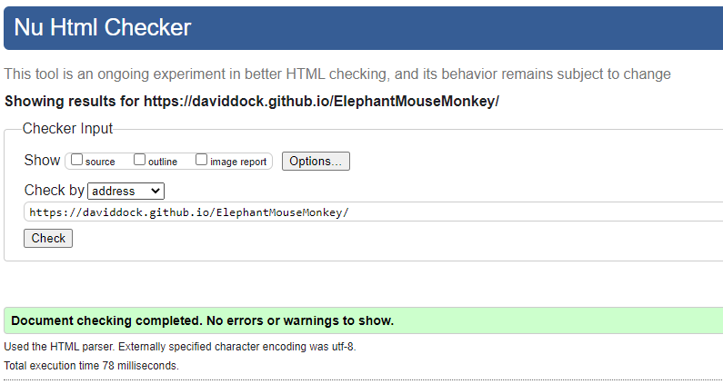
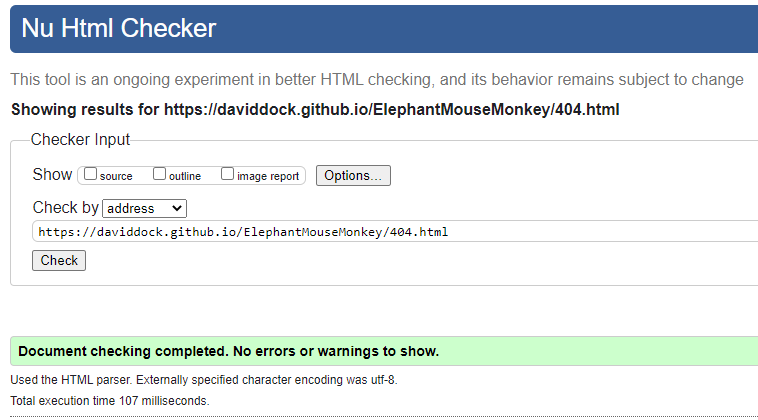
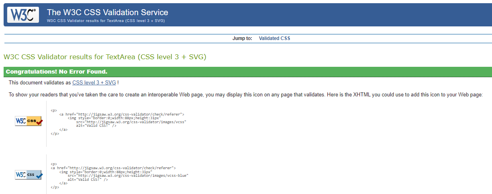
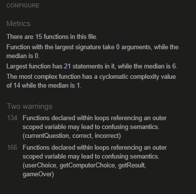
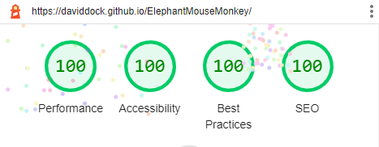
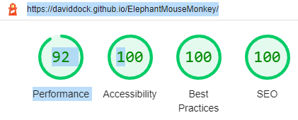
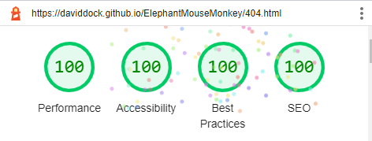
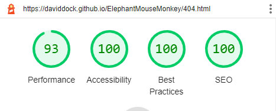
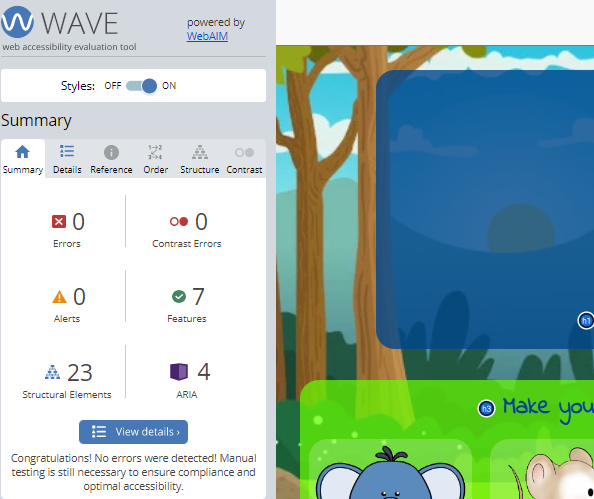
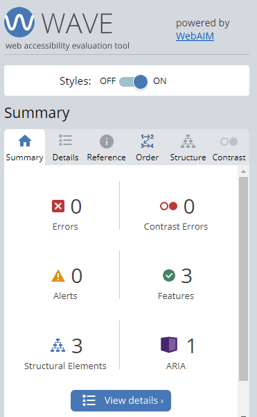

## CONTENTS

* [HTML Validator](#html-validator)
* [CSS Validator](#css-validator)
* [JavaScript Validator](#javascript-validator)
* [Lighthouse](#lighthouse)
* [Wave](#wave)
* [Device Responsiveness](#device-responsiveness)
* [Manual Testing](#manual-testing)

## HTML Validator  

### Problems highlighted and how they were fixed  

* There were unwanted // inside the meta elements in the head of the html document.  
  This was fixed by removing them.

### Final Test Results

## CSS Validator  

### Problems highlighted and how they were fixed  

* .button had an unknown value of re instead of rem.  
  The fix was to correct spelling mistake.  

* The font family Indie Flower was not encased in ''.  
  This was fixed by adding ''.

* Overflow-y: overlay was not recognised in the validator.  
  I changed this to a more modern overflow-y: scroll to fix issue.

### Final Test Results  

## JavaScript Validator 

### Problems highlighted and how they were fixed  

* A number of unnecessary semi-colons were found.
  These semi-colons were deleted to fix the warning.

* There were 2 warnings stating: Functions declared within loops referencing out scoped variable may lead to confusing semantics. This was where I initially had two long functions within click event listener loops containing other functions. These were for both my answer buttons and user animal choice buttons.  
  I fixed the issue by adding two functions for when the relevant button was clicked ('questionClick' and 'gamRun') so I could take the other functions out of the loop.  

### Final Test Results  

## Lighthouse  

### Problems highlighted and how they were fixed  

* The 404 page had a contrast issue with the text color.  
  I change the text to black to fix the problem.  

* Large images affecting the performance score.  
  All the images and gif was changed to webp files to reduce size and I scaled down the images to reduce further. This helped the performance score to get to 100 on desktop. Lighthouse was stating that these images affected the cache performance on the mobile device so the score was a bit lower than I would have liked. Cache issues are out of scope of this project but I will look into this in the future.  
   

### Final Test Results

  

  

  

## Wave  

### Problems highlighted and how they were fixed  

* Warnings on alt image descriptions.  
  I changed the image descriptions to make clearer and this fixed the warning.

* Warning about 15 possible headings instead of paragraph elements.  
  All sugested changes were made and this fixed the issue.

* Redundant link on 404 page. There was a link back to the question area both when you press the logo and the play again button.  
  I removed the link n the logo and it fixed the warning.  
   

### Final Test Results

  

  

## Device Responsiveness  

Responsiveness was tested throughout the development by using dev tools on every section of the site. I then thoroughly tested the site on [responsivedesignchecker.com](https://www.responsivedesignchecker.com/checker.php?url=https%3A%2F%2Fdaviddock.github.io%2FElephantMouseMonkey%2F&width=1400&height=700), especially focusing on whether the site works on small devices of 320px wide and also the desktop breakpoint of 1024px wide. This website is fully responsive on all devices.  

## Manual Testing  

This website has been tested on mobile devices, tablets and laptop and as mentioned in the responsiveness section above It has been thoroughly tested with dev tools and [responsivedesignchecker.com](https://www.responsivedesignchecker.com/checker.php?url=https%3A%2F%2Fdaviddock.github.io%2FElephantMouseMonkey%2F&width=1400&height=700).  
I have tested the site on Chrome, Safari and Microsoft Edge browsers and it works well on all.  

I undertook the following testing for the website:

### Question Area  

| Feature | Expected Outcome | Test Performed | Result | Pass/Bug fixed |  
| --- | --- | --- | --- | --- |  
| Logo links to the question area | The page refreshes | Clicked the logo several times | Refreshes page | Pass |

