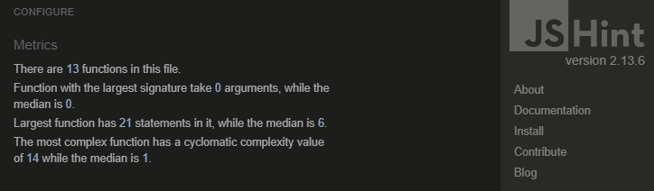

## CONTENTS

* [HTML Validator](#html-validator)
* [CSS Validator](#css-validator)
* [JavaScript Validator](#javascript-validator)
* [Lighthouse](#lighthouse)
* [Wave](#wave)
* [Device Responsiveness](#device-responsiveness)
* [Manual Testing](#manual-testing)

## HTML Validator  

## CSS Validator  

## JavaScript Validator  

## Lighthouse  

  

  

  

## Wave  

  

  

## Device Responsiveness

The website used was [responsivedesignchecker.com](https://www.responsivedesignchecker.com/checker.php?url=https%3A%2F%2Fdaviddock.github.io%2FElephantMouseMonkey%2F&width=1400&height=700).  

## Manual Testing  

